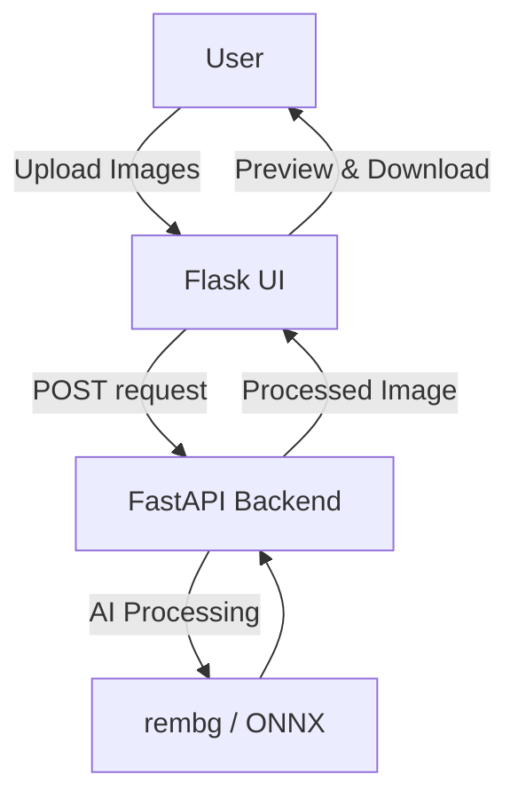

# CarClinch – Background Replacement Application

## Demo

---

CarClinch is a web application that allows users to replace the background of a car image with a custom background image.

🔗 Live Demo: https://carclinch-bg-removal-api-1.onrender.com/

---

## Overview

The application:

- Uploads a car image
- Removes its background using AI
- Places the car onto a new background
- Allows preview and download of the final image

This project is an evolution of a background removal tool, extended with background replacement functionality.

---

## Features

- Upload car image
- Upload background image
- Smart background replacement
- Image preview (click to zoom)
- Download final image
- Mobile-first responsive UI

---

## Screenshots

### Upload

### Choose Files

### Input Preview

### Result

### Preview

---

## Tech Stack

**Frontend**

- Flask
- HTML / CSS / JavaScript

**Backend**

- FastAPI
- rembg (ONNX model)
- Pillow / NumPy

**Deployment**

- Render (API + UI as separate services)

---

## Architecture

---

## Notes

- Multiple models were tested during development
- A single optimized model is used in deployment for performance and cost efficiency
- Designed for demonstration purposes
